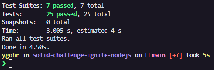

# ⚔️ Ignite - Desafio 4 : Conceitos de SOLID

<br>

## :pushpin: Sobre o Desafio
Esta aplicação tem como objetivo a aplicação dos princípios de SOLID, implementando algumas funcionalidades como:
- Criar um novo usuário
- Listar um usuário por ID
- Tornar o usuário ADMIN
- Listar todos os usuários através de um usuário ADMIN.

O _template_ de arquivos utilizados neste projeto pode ser acessado em: [**template.**](https://github.com/rocketseat-education/ignite-template-introducao-ao-SOLID)

## 📋 Requisitos e Regras de Negócio
O documento de referência de Requisitos e Regras de Negócio pode acessado através deste [**link.**](https://www.notion.so/Requisitos-e-Regras-de-Neg-cio-Introdu-o-ao-SOLD-M-dulo-2-Desafio-1-Ignite-25bc1f6f6d0648daa6661208c58a4fad)

## 💻 Instalação, Dependências e Executando o Projeto
**1.** Clone este repositório 
```
git clone https://github.com/Ygohr/solid-challenge-ignite-nodejs
``` 
**2.** Vá até o diretório raiz do projeto
```
cd solid-challenge-ignite-nodejs
``` 
**3.** Instale as dependências necessárias
```
yarn 
ou
npm install
```
**4.** Execute a aplicação
```
yarn dev
```

## :floppy_disk: Usando a Aplicação
Para realização de **requisições** na aplicação, deve ser utilizado o **Insomnia** ou **Postman**, importando o [arquivo](insomnia_requests) de requisições já existente neste diretório.
Atentar-se aos parâmetros necessários no **Header**.

## :syringe: Evidência de Testes
Nesta aplicação, são contemplados **Testes Unitários**, visando garantir o correto funcionamento das funcionalidades e manter a aplicação de acordo com os requisitos. <br/>



- **Desenvolvido** **por** [**Ygohr**](https://www.linkedin.com/in/ygohr-medeiros-28451b14a/) 🤖
